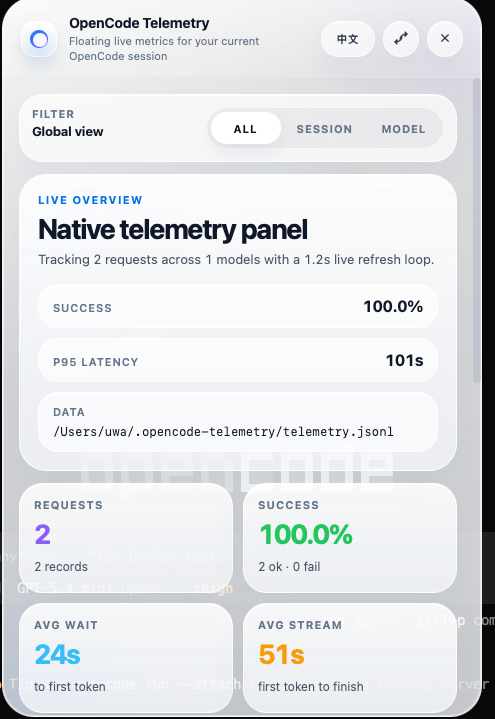

# OpenCode Telemetry Panel

OpenCode 监控插件 + Tauri 浮窗面板。

English: [README.md](./README.md)




## Change Log

`v0.0.7` 到 `72761b9`（`v0.0.8`）之间的核心改动：

- 新增全局、会话、模型三种筛选视图，可以按范围查看指标、模型表现和最近请求。
- 扩展原生快照和 telemetry 聚合逻辑，让筛选项和看板指标在每次刷新时保持同步。
- 重做浮窗面板视觉样式，更新玻璃态布局、信息层级和中英双语文案。

## 功能

- 监听 OpenCode 事件并记录请求指标。
- 将 telemetry 保存到 `~/.opencode-telemetry/telemetry.jsonl`。
- 由插件拉起本地浮窗面板。
- 插件加载时自动下载匹配平台的可执行文件。

## 仓库结构

- `plugin/opencode-telemetry-panel.ts` OpenCode 插件入口。
- `src/` Solid 前端界面。
- `src-tauri/` Tauri 后端。
- `scripts/postinstall.mjs` 二进制下载脚本。

## 在 OpenCode 中安装

把已发布的 npm 包写入全局或项目级 OpenCode 配置：

```json
{
  "$schema": "https://opencode.ai/config.json",
  "plugin": ["@wuyoumaster/opencode-telemetry-panel@0.0.8"]
}
```

更新配置后重启 OpenCode。插件首次加载时，会把对应平台的原生二进制下载到 `~/.opencode-telemetry/`。

## 手动安装 npm 包

```bash
bun add @wuyoumaster/opencode-telemetry-panel
```

或者

```bash
npm i @wuyoumaster/opencode-telemetry-panel
```

手动安装 npm 包时仍会执行 `postinstall`，把对应平台的可执行文件下载到 `~/.opencode-telemetry/`。

## 环境变量

- `OPENCODE_TELEMETRY_PANEL_REPO` 覆盖下载二进制时使用的 GitHub 仓库地址。
- `OPENCODE_TELEMETRY_PANEL_BIN` 手动指定可执行文件路径。
- `OPENCODE_TELEMETRY_PANEL_SKIP_DOWNLOAD=1` 可在 CI 安装时跳过二进制下载。

## 支持平台

- Windows x64
- macOS x64
- macOS arm64

暂时不发布 Linux 构建产物。

## 开发

```bash
bun install
bun run tauri dev
```

## 构建可执行文件

```bash
bun run build:exe
```

这里只输出可执行文件，不生成安装包。

## 发布

- 推送 `v*` tag 会同时触发 npm 发布和 GitHub Release。
- GitHub Release 会附带各平台的可执行文件。

## 说明

- 插件默认从 `~/.opencode-telemetry/OpenCodeTelemetryPanel(.exe)` 读取可执行文件。
- Windows 下文件名是 `OpenCodeTelemetryPanel.exe`。
